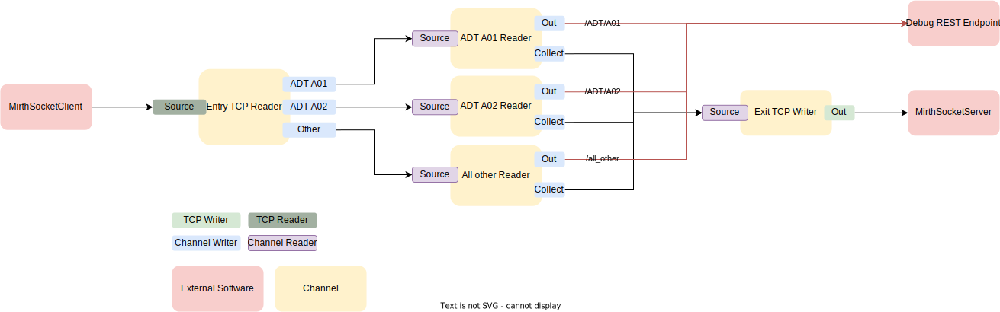

# Complex Example

The "complex example" is designed to show how to 
* distribute incoming messages to different channels based on simple filters
* unite messages from multiple channels into one channel

To do that, the following structure has been implemented:

<figure style="text-align: center;" id="ComplexExampleChannels">



<figcaption style="text-align: center;">The structure of the complex example</figcaption>
</figure>


## Channels
### Entry TCP Reader

This channel is the entry point for all messages in this scenario. 
The source is of type `TCPReader` which hosts a TCP socket for the `MirthSocketClient` to connect to.

Each message that is written to this socket is filtered based on the type of the message. The type of the message is determined by Mirth based on `MSH.9` and stored in `mirth_type`.
Depending on which message type is found, the message is routed to one of the three destinations.

```json
{
  "Source": {
    "Type": "TCPReader",
    "Mode": "Server",
    "Transmission Mode": "MLLP",
    "MLLP": {
      "Use MLLPv2": "yes",
      "Start of Message": "0x0B",
      "End of Message": "0x1C0D",
      "Commit ACK": "0x06",
      "Commit NACK": "0x15"
    }
  },
  "Destinations": [
    {
      "Type": "ChannelWriter",
      "Filter": "mirth_type.contains('ADT-A01')",
      "Target": "ADT A01 Reader"
    },
    {
      "Type": "ChannelWriter",
      "Filter": "mirth_type.contains('ADT-A02')",
      "Target": "ADT A02 Reader"
    },
    {
      "Type": "ChannelWriter",
      "Filter": "not mirth_type.contains('ADT-A01') and not mirth_type.contains('ADT-A02')",
      "Target": "All other Reader"
    }
  ]
}
```

### ADT A01 Reader
This channel receives all the ADT A01 messages and routes them to 2 destinations. 
The first destination sends the message to the configured REST endpoint (via HTTP) and the second destination writes the message back to a channel.

```json 
{
  "Source": {
    "Type": "ChannelReader"
  },
  "Destinations": [
    {
      "Type": "HTTPSender",
      "Target": "http://endpoint:port/ADT/A01"
    },
    {
      "Type": "ChannelWriter",
      "Target": "Exit TCP Writer"
    }
  ]
}
```

### ADT A02 Reader
This channel receives all the ADT A02 messages and routes them to 2 destinations.
The first destination sends the message to the configured REST endpoint (via HTTP) and the second destination writes the message back to a channel.
```json 
{
  "Source": {
    "Type": "ChannelReader"
  },
  "Destinations": [
    {
      "Type": "HTTPSender",
      "Target": "http://endpoint:port/ADT/A02"
    },
    {
      "Type": "ChannelWriter",
      "Target": "Exit TCP Writer"
    }
  ]
}
```

### All other Reader
This channel receives all the ADT messages that are not A01 or A02 and routes them to 2 destinations.
The first destination sends the message to the configured REST endpoint (via HTTP) and the second destination writes the message back to a channel.

```json 
{
  "Source": {
    "Type": "ChannelReader"
  },
  "Destinations": [
    {
      "Type": "HTTPSender",
      "Target": "http://endpoint:port/all_other"
    },
    {
      "Type": "ChannelWriter",
      "Target": "Exit TCP Writer"
    }
  ]
}
```

### Exit TCP Writer
This channel has a `ChannelReader` source which receives the messages of whatever channel writes to it. 
Each message is the written to a TCP socket.

```json
{
    "Source": {
      "Type": "ChannelReader"
    },
    "Destinations": [
      {
        "Type": "TCPWriter",
        "Mode": "Client",
        "Host": "host.docker.internal",
        "Port": "3001",
        "Transmission Mode": "MLLP",
        "MLLP": {
          "Use MLLPv2": "yes",
          "Start of Message": "0x0B",
          "End of Message": "0x1C0D",
          "Commit ACK": "0x06",
          "Commit NACK": "0x15"
        }
      }
    ]
}
```

## Example execution

Given that:
- `MirthSocketServer` is running and listening on `host.docker.internal:3001`
- `MirthSocketClient` is configured 
  - to send one message
  - to print verbose messages
- `Rest Endpoint` is running
- `Mirth Connect` is running and the `Complex Example` Group has been imported and deployed

The outputs below should be observable.

### ADT A01
When sending the message: 
```
MSH|^~\\&|x|000000|CERNER|HOSPITAL-A|201401291848||ADT^A01|1912340911|P|2.3|||AL|NE|
EVN|A01|201401291848|||REJKB1
PID||ABC123|987654|ALT789|PETTY^TOM^^^^||19781218|M||2106-3|10144 MAPLE AVE^^IRVINE^CA^92614||(949)123-1234|||||0053820452|220675537||AME||||1|||||
PV1||I|S-2302-1^S-2302^A|C|||1111111^PINA|||SUR|||||A0||1111111^PINA|S||S|P||||||||||||||||||IAH|||||201401291848|
PV2||D|42.41^Partial esophagectomy^I9|||||201401290900|201401310900|3|3|||||||||||||||||||||||||a|
```

The following outputs should be observed:

`MirthSocketClient` logs the hexdump of the message:
``` hexdump
0B 4D 53 48 7C 5E 7E 5C 26 7C 78 7C 30 30 30 30 30 30 7C 43 45 52 4E 45 52 7C 48 4F 53 50 
49 54 41 4C 2D 41 7C 32 30 31 34 30 31 32 39 31 38 34 38 7C 7C 41 44 54 5E 41 30 31 7C 31 
39 31 32 33 34 30 39 31 31 7C 50 7C 32 2E 33 7C 7C 7C 41 4C 7C 4E 45 7C 0D 0A 45 56 4E 7C 
41 30 31 7C 32 30 31 34 30 31 32 39 31 38 34 38 7C 7C 7C 52 45 4A 4B 42 31 0D 0A 50 49 44 
7C 7C 41 42 43 31 32 33 7C 39 38 37 36 35 34 7C 41 4C 54 37 38 39 7C 50 45 54 54 59 5E 54 
4F 4D 5E 5E 5E 5E 7C 7C 31 39 37 38 31 32 31 38 7C 4D 7C 7C 32 31 30 36 2D 33 7C 31 30 31 
34 34 20 4D 41 50 4C 45 20 41 56 45 5E 5E 49 52 56 49 4E 45 5E 43 41 5E 39 32 36 31 34 7C 
7C 28 39 34 39 29 31 32 33 2D 31 32 33 34 7C 7C 7C 7C 7C 30 30 35 33 38 32 30 34 35 32 7C 
32 32 30 36 37 35 35 33 37 7C 7C 41 4D 45 7C 7C 7C 7C 31 7C 7C 7C 7C 7C 0D 0A 50 56 31 7C 
7C 49 7C 53 2D 32 33 30 32 2D 31 5E 53 2D 32 33 30 32 5E 41 7C 43 7C 7C 7C 31 31 31 31 31 
31 31 5E 50 49 4E 41 7C 7C 7C 53 55 52 7C 7C 7C 7C 7C 41 30 7C 7C 31 31 31 31 31 31 31 5E 
50 49 4E 41 7C 53 7C 7C 53 7C 50 7C 7C 7C 7C 7C 7C 7C 7C 7C 7C 7C 7C 7C 7C 7C 7C 7C 7C 49 
41 48 7C 7C 7C 7C 7C 32 30 31 34 30 31 32 39 31 38 34 38 7C 0D 0A 50 56 32 7C 7C 44 7C 34 
32 2E 34 31 5E 50 61 72 74 69 61 6C 20 65 73 6F 70 68 61 67 65 63 74 6F 6D 79 5E 49 39 7C 
7C 7C 7C 7C 32 30 31 34 30 31 32 39 30 39 30 30 7C 32 30 31 34 30 31 33 31 30 39 30 30 7C 
33 7C 33 7C 7C 7C 7C 7C 7C 7C 7C 7C 7C 7C 7C 7C 7C 7C 7C 7C 7C 7C 7C 7C 7C 7C 7C 7C 61 7C 
1C 0D 
```
The first byte (`0x0B`) is the message start byte. The last 2 bytes (`1C 0D`) are the end bytes.


`MirthSocketClient` receives the ACK:
```hexdump
0B 06 1C 0D 0B 4D 53 48 7C 5E 7E 5C 26 7C 43 45 52 4E 45 52 7C 48 4F 53 50 49 54 41 4C 2D 
41 7C 78 7C 30 30 30 30 30 30 7C 32 30 32 33 30 37 32 34 31 30 31 37 30 30 2E 30 38 38 7C 
7C 41 43 4B 7C 32 30 32 33 30 37 32 34 31 30 31 37 30 30 2E 30 38 38 7C 50 7C 32 2E 33 0D 
4D 53 41 7C 41 41 7C 31 39 31 32 33 34 30 39 31 31 0D 1C 0D 
```

Interestingly, even though the Source is configured to use `MLLPv2`, 2 ACKS are sent. 
The first 4 bytes are the `MLLPv2` ACK:
```hexdump
0B 06 1C 0D
```
which consists of the frame (as above) and the `Commit ACK Byte` (`0x06`). 

Then a HL7 V2 ACK message follows which is framed as well.

```hexdump
0B 4D 53 48 7C 5E 7E 5C 26 7C 43 45 52 4E 45 52 7C 48 4F 53 50 49 54 41 4C 2D 
41 7C 78 7C 30 30 30 30 30 30 7C 32 30 32 33 30 37 32 34 31 30 31 37 30 30 2E 30 38 38 7C 
7C 41 43 4B 7C 32 30 32 33 30 37 32 34 31 30 31 37 30 30 2E 30 38 38 7C 50 7C 32 2E 33 0D 
4D 53 41 7C 41 41 7C 31 39 31 32 33 34 30 39 31 31 0D 1C 0D 
```
which is decoded to:

```
MSH|^~\&|CERNER|HOSPITAL-?A|x|000000|20230724101700.088||ACK|20230724101700.088|P|2.3
MSA|AA|1912340911
```

Then, the `Debug REST endpoint` logs the following request:

``` 
stack-rest-1  | info: DebugRestEndpoint.Controllers.MockEndpointController[0]
stack-rest-1  |       Name: Endpoint 1
stack-rest-1  |       Method: POST
stack-rest-1  |       Relative Path: ADT/A01/
stack-rest-1  |       Body:
stack-rest-1  |       MSH|^~\&|x|000000|CERNER|HOSPITAL-A|201401291848||ADT^A01|1912340911|P|2.3|||AL|NE|
stack-rest-1  |       EVN|A01|201401291848|||REJKB1
stack-rest-1  |       PID||ABC123|987654|ALT789|PETTY^TOM^^^^||19781218|M||2106-3|10144 MAPLE AVE^^IRVINE^CA^92614||(949)123-1234|||||0053820452|220675537||AME||||1|||||
stack-rest-1  |       PV1||I|S-2302-1^S-2302^A|C|||1111111^PINA|||SUR|||||A0||1111111^PINA|S||S|P||||||||||||||||||IAH|||||201401291848|
stack-rest-1  |       PV2||D|42.41^Partial esophagectomy^I9|||||201401290900|201401310900|3|3|||||||||||||||||||||||||a|
```


Then the `MirthSocketServer` logs the following:

```hexdump
0B 4D 53 48 7C 5E 7E 5C 26 7C 78 7C 30 30 30 30 30 30 7C 43 45 52 4E 45 52 7C 48 4F 53 50 
49 54 41 4C 2D 41 7C 32 30 31 34 30 31 32 39 31 38 34 38 7C 7C 41 44 54 5E 41 30 31 7C 31 
39 31 32 33 34 30 39 31 31 7C 50 7C 32 2E 33 7C 7C 7C 41 4C 7C 4E 45 7C 0D 45 56 4E 7C 41 
30 31 7C 32 30 31 34 30 31 32 39 31 38 34 38 7C 7C 7C 52 45 4A 4B 42 31 0D 50 49 44 7C 7C 
41 42 43 31 32 33 7C 39 38 37 36 35 34 7C 41 4C 54 37 38 39 7C 50 45 54 54 59 5E 54 4F 4D 
5E 5E 5E 5E 7C 7C 31 39 37 38 31 32 31 38 7C 4D 7C 7C 32 31 30 36 2D 33 7C 31 30 31 34 34 
20 4D 41 50 4C 45 20 41 56 45 5E 5E 49 52 56 49 4E 45 5E 43 41 5E 39 32 36 31 34 7C 7C 28 
39 34 39 29 31 32 33 2D 31 32 33 34 7C 7C 7C 7C 7C 30 30 35 33 38 32 30 34 35 32 7C 32 32 
30 36 37 35 35 33 37 7C 7C 41 4D 45 7C 7C 7C 7C 31 7C 7C 7C 7C 7C 0D 50 56 31 7C 7C 49 7C 
53 2D 32 33 30 32 2D 31 5E 53 2D 32 33 30 32 5E 41 7C 43 7C 7C 7C 31 31 31 31 31 31 31 5E 
50 49 4E 41 7C 7C 7C 53 55 52 7C 7C 7C 7C 7C 41 30 7C 7C 31 31 31 31 31 31 31 5E 50 49 4E 
41 7C 53 7C 7C 53 7C 50 7C 7C 7C 7C 7C 7C 7C 7C 7C 7C 7C 7C 7C 7C 7C 7C 7C 7C 49 41 48 7C 
7C 7C 7C 7C 32 30 31 34 30 31 32 39 31 38 34 38 7C 0D 50 56 32 7C 7C 44 7C 34 32 2E 34 31 
5E 50 61 72 74 69 61 6C 20 65 73 6F 70 68 61 67 65 63 74 6F 6D 79 5E 49 39 7C 7C 7C 7C 7C 
32 30 31 34 30 31 32 39 30 39 30 30 7C 32 30 31 34 30 31 33 31 30 39 30 30 7C 33 7C 33 7C 
7C 7C 7C 7C 7C 7C 7C 7C 7C 7C 7C 7C 7C 7C 7C 7C 7C 7C 7C 7C 7C 7C 7C 7C 61 7C 0D 1C 0D 
```

This is the same binary payload that has been initially sent to the socket and thus shows the complete round trip. 
Now, looking at Mirth Connect in the `Dashboard` section, we should see that: 
- The `Entry TCP Reader` received 1 message
  - `ADT A01` destination shows one as sent
  - `ADT A02` shows one as filtered
  - `All other` shows one as filtered
- `ADT A01 Reader` shows one as received
  - `Destination` shows one as sent
- `ADT A02 Reader` did not receive or send messages
- `All other Reader` did not receive or send messages
- `Exit TCP Reader` 
  - received 1 message
  - sent 1 message